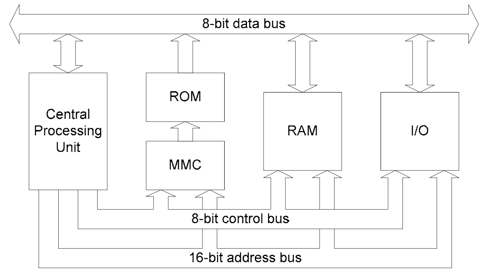
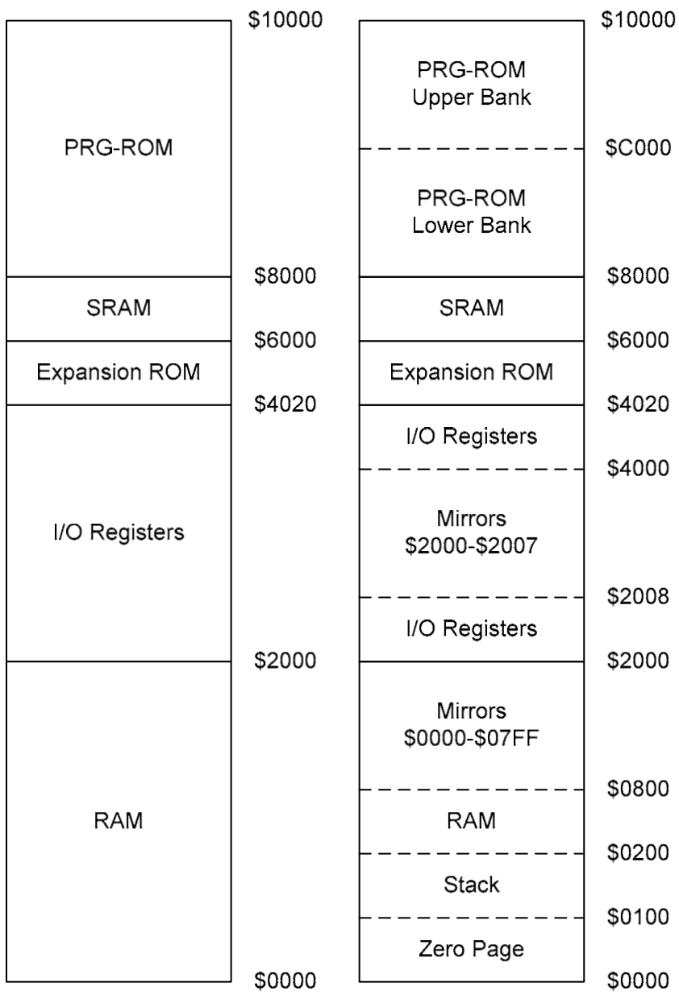

# CPU
采用改造的8位6502的MOS处理器，产于1975年。时钟周期：1.773447MHz

PPU(*Picture Processing Unit*)，图像处理器。

NES使用内存映射IO技术(*memory mapped I/O*)，使得处理器写入指定内存位置，即可对外设进行交互（PPU，输入设备）

CPU采用改造的8位6502处理器（指令集一致），由Ricoh生产的NMOS处理器，代号2A03，拥有处理声音的能力，但是缺少BCD码支持。

6502是一个little-endian处理器，高地址存放数据高位，低地址存放数据低位。

## 内存布局
采用三总线结构来范围内存，内存被划分为3个部分：
- ROM/MMC（内存管理芯片）
- RAM
- I/O(PPU和控制器)

16位地址线用于指定目标的位置，8位控制线用于设置目标是读还是写，8位数据线用于读写指定位置的数据，而ROM是只读的，由MMC来访问。


2A03的16位的地址线，能够支持64KB大小的内存，从`0x0000-0xffff`。

- `0x0000-0x00ff`，Zero Page，内存的第一页，用于快速寻址。
- `0x0100-0x01ff`，栈区
- `0x0800-0x1fff`，这块区域用于对Zero Page镜像3次，意味着，写到`0x0000`，同时也会写到`0x0800`, `0x1000`, `0x1800`
- `0x2000-0x401f`，内存映射IO寄存器，从`0x2000-0x2007`这8个字节镜像填充满`0x2008-0x3fff`区域。
- `0x6000-0x7fff`，SRAM，用于访问卡带中的RAM来保存游戏用。
- `0x8000-0xffff`，这块区域被用于访问卡带的程序ROM，程序ROM以16KB为一个单位块(*bank*)，又可以细分为2块：
	- `0x8000-0xbfff`，只有一块的时候
	- `0xc000-0xffff`，只有一块的时候也复制到这里，若有两块的时候，第二块读到这里

若游戏ROM超过2块大小，使用mapper内存映射来决定哪块加载进内存，也就是*bank switch*。



## 寄存器
6502有6个寄存器，其中3个特殊寄存器，3个通用寄存器：
- 程序计数器（PC），栈指针（SP），状态寄存器（P）
- 累加器（A），X，Y寄存器（Index Register）

程序计数器（PC）是16位寄存器，存放下一条待执行的指令地址。

栈指针（SP）是8位寄存器，指向栈区（`0x0100-0x01ff`），从`0x0100`的内存位置作为偏移量，空递减堆栈，也不会检测栈溢出（`0x00-0xff`）。

累加器（A）是8位寄存器，存储算数、逻辑运算的结果。

X寄存器是8位寄存器，一般做计数器或者用于一些寻址方式的偏移值，或者SP的临时值。

Y寄存器和X寄存器一样，但是不能用来做SP的临时值。

8位状态寄存器（P）受到指令执行后的影响。
```
76543210
NV BDIZC
```

- 负数标志位（N），当运算结果最高位第7位为1的时候置位，表明负数。
- 溢出标志位（V），当两个补码运算产生非法的结果置位，例如正+正为负的时候。
- Break指令标志（B），用于标记当`BRK`指令执行后，产生的IRQ中断（软件中断）。
- 十进制模式（D），6502通过设置该标志位切换到BCD模式，由于2A03不支持BCD，所以这位是无效的。`SED`指令置位，`CLD`指令复位。
- 中断屏蔽标志位（I），通过设置该位可以屏蔽IRQ中断。`SEI`指令置位，`CLI`指令复位。
- 零标志位（Z），当运算结果为0的时候置位。
- 进位标志位（C），当运算结果最高位第7位符号翻转的时候置位。`SEC`置位，`CLC`复位。

## 中断
NES有3种中断：
- NMI，不可屏蔽中断，在PPU中当V-Blank出现在每一帧的结尾时产生。不过它可以被PPU的控制寄存器1（位于其`0x2000`）所屏蔽（第7位为0的时候）。向量地址位于`0xfffa`和`0xfffb`。
- IRQ，可屏蔽中断，受到中断屏蔽标志位的影响，也能被`BRK`指令触发。向量地址保存于`0xfffe`和`0xffff`。
- Reset，当用户按下复位按钮的时候产生。向量地址位于`0xfffc`和`0xfffd`。

优先级如下：Reset > NMI > IRQ。中断产生到开始执行之间有7个cpu时钟周期的间隔。

中断向量表存放于`0xfffa-0xffff`。发生中断产生以下几个步骤：
1. 识别中断请求
2. 完成当前指令
3. 将PC，P寄存器入栈（保存现场）
4. 设置中断屏蔽标志，以防再次中断（关中断）
5. 将PC设置为位于中断向量表的中断程序地址
6. 执行中断程序
7. 执行RTI指令（相当于x86的IRET指令），出栈保存到PC，P寄存器（恢复现场）
8. 程序继续执行

## 寻址方式
6502有13种寻址方式，有些可以对寄存器进行操作。

## 指令集
6502有56条不同的指令，有些指令因为不同的寻址方式有不同的变种，总共有151个操作码。指令长度在1到3字节，第一字节为操作码，后面的为操作数。指令有以下几类：
- Load/Store指令，读内存数据到寄存器，从寄存器写到内存
- 寄存器转移指令，复制X或Y寄存器内容到累加器（A）中，或相反
- 栈操作指令，入栈或出栈，根据X寄存器的值来读写栈指针
- 逻辑运算指令，对累加器（A）和内存中的值进行逻辑运算
- 算术运算，对寄存器和内存进行算术运算
- 增减指令，对X,Y寄存器或内存的值进行增减运算
- 位移指令，对累加器（A）或内存中的值进行位移操作
- 跳转/调用指令，跳到指定地址继续执行
- 分支指令，当条件满足（P寄存器）的时候跳到指定地址继续执行
- 操作状态寄存器指令，设置状态寄存器的某些标志位
- 系统指令，执行一些系统功能
